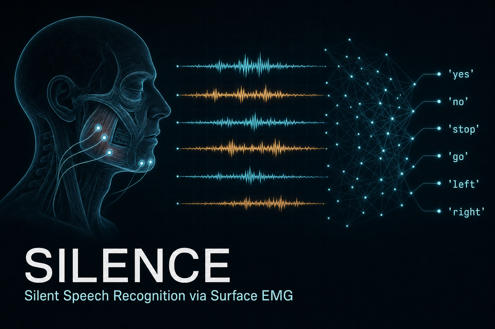

<p align="center">
  
</p>

<h1 align="center">Silence</h1>

<p align="center">
  <b>A personal silent-speech recognition system. A DIY AlterEgo.</b><br/>
  Surface EMG of the speech muscles, decoded into words you never say out loud.
</p>

---

## What this is

Silence reads the faint electrical activity your jaw and face muscles produce when you *mouth or subvocalize* a word, and classifies it into text. No voice, no visible movement, no microphone. Same fundamental method as MIT's [AlterEgo](https://www.media.mit.edu/projects/alterego/overview/) (2018): **surface electromyography (sEMG)**, not EEG or brainwave reading.

It is built and trained for **one user (me)**. No generalization is required for v1, which is exactly what makes near-human accuracy realistic on hobbyist hardware.

| | |
|---|---|
| **MVP target** | Recognize a closed **20-word** vocabulary, single user |
| **Quality goal** | AlterEgo-level, ~**92%** accuracy on a personal vocabulary |
| **Method** | Surface EMG on masseter + mentalis (jaw/chin), classified with PyTorch |
| **End goal** | Silent universal translation + an invisible AI-assistant interface |

> This is a research/personal project. The two-model self-supervised bootstrapping approach (below) is potentially novel enough to publish if it works, so everything is documented as I go.

---

## How it works

```
  speech muscles  →  sEMG electrodes  →  filter + epoch  →  neural net  →  word
   (mouth / subvocalize)   8 channels       20–500 Hz        classifier
```

**The two-model cascade** (the interesting part):

1. **Model 1 — overt mouthing.** Trained on clearly mouthed speech. The EMG signal is strong and easy to supervise. This is the bootstrap.
2. **Model 2 — pure subvocalization.** Zero visible movement. Trained using Model 1's predictions on *paired* recordings as soft labels (self-supervised distillation).

At inference, both models run as an ensemble and the system switches between them based on signal amplitude. The subvocal gap, getting useful signal with no visible movement, is the one genuinely hard part, and this cascade is how we close it.

---

## Project status

The hardware and ML tracks run in parallel so neither blocks the other.

| Track | State |
|---|---|
| **Hardware** | OpenBCI V3 clone board streams 8 channels over BrainFlow. Current blocker is **electrode signal quality** — gold cups + tape introduced movement artifacts; upgraded to Kendall Ag/AgCl snap electrodes. |
| **ML pipeline** | Full pipeline runs on the public **Gaddy & Klein 2020** sEMG dataset as a stand-in for personal data. Baseline 1D CNN at ~**34%** on 20-class closed-vocab (early; the number is a pipeline sanity check, not the ceiling). |
| **Recorder** | Flask recording harness is ready. Runs today on a `MockBoard`; swapping to the real Cyton board is a one-class change, no UI rewrite. |

Designing against the public dataset now means that when the board produces clean signal, going live is a **data-source swap, not a rewrite**.

---

## Repo layout

```
Silence/
├── ml_backend/      # PyTorch pipeline: data loaders, preprocessing, models, training
│   ├── silence_ml/  #   library code (data / preprocess / models)
│   ├── scripts/     #   download Gaddy, train baseline
│   └── vocab/       #   mvp_20words.txt (personal target) + gaddy_closed_top20.txt
├── recorder/        # Flask harness for recording labeled EMG trials
├── journal/         # chronological session logs — the real source of truth
└── readme_images/
```

See the per-module READMEs for detail:
- [`ml_backend/README.md`](ml_backend/README.md) — pipeline architecture, dataset choice, stack decisions
- [`recorder/README.md`](recorder/README.md) and [`recorder/DATA_COLLECTION.md`](recorder/DATA_COLLECTION.md) — recording harness and the data-collection plan for hitting each accuracy tier

---

## Hardware

| Item | Role |
|---|---|
| OpenBCI V3-compatible 8-channel board | sEMG acquisition (Arduino-based) |
| Kendall H124SG Ag/AgCl snap electrodes | Skin contact on moving face muscles |
| OpenBCI Gold Cup electrodes | Backup contact option |
| DuPont jumper wires, medical tape, alcohol prep | Connections, securing, skin prep |
| PSIER bone-conduction headphones | Audio feedback, to close the loop |

**Electrode placement:** bipolar channels on the masseter (jaw hinge) and orbicularis oris / mentalis (chin), the muscles that drive articulation. Purely surface EMG of speech muscles, *not* EEG.

---

## Software stack

- **Python 3.12**, **PyTorch 2.11** (raw — no Lightning, no Hydra)
- **NumPy / SciPy / MNE-Python** for filtering (20–500 Hz bandpass), epoching, features
- **BrainFlow** for live OpenBCI streaming
- **Compute:** M2 Pro Mac mini + Ubuntu workstation + cloud/agent fleet

---

## Roadmap

- [x] ML pipeline scaffold + Gaddy dataset loader
- [x] Baseline 1D CNN on the 20-class closed vocabulary
- [x] Recording harness (Flask + MockBoard)
- [ ] Clean, repeatable signal from the real board
- [ ] First personal recording session + Model 1 training
- [ ] Model 2: subvocalization self-distillation
- [ ] Two-model cascade inference + amplitude switching
- [ ] Real-time demo loop with bone-conduction audio feedback
- [ ] Rigid 3D-printed jaw wearable for consistent electrode placement
